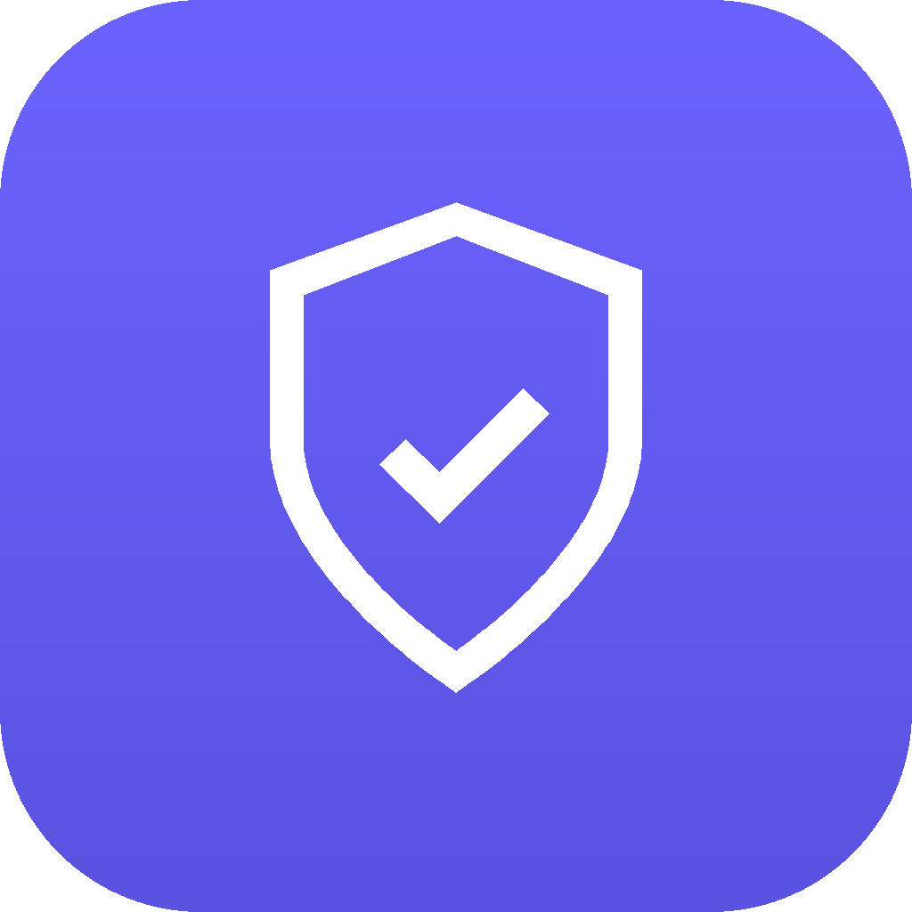
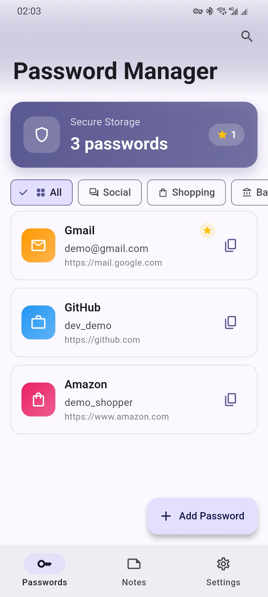
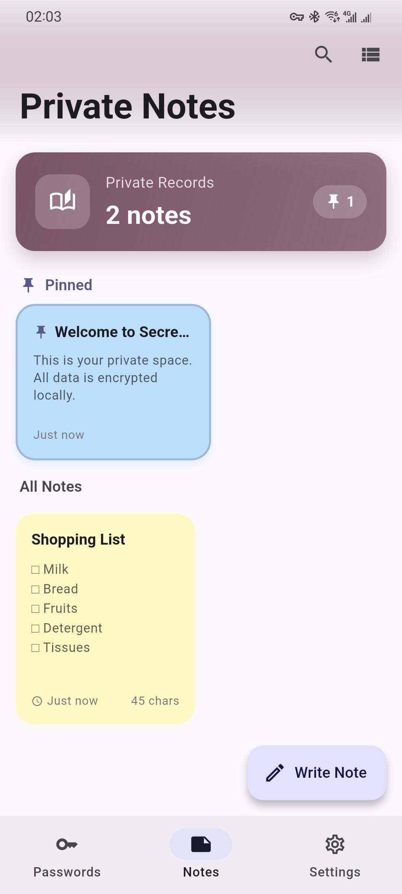
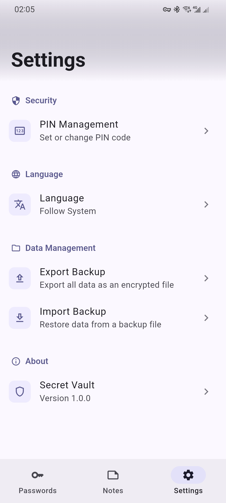

# Secret Vault

<p align="center">
  
</p>

<p align="center">
  A privacy-focused local password manager & private notes app with AES-256 encryption.
</p>

<p align="center">
  <a href="https://flutter.dev"></a>
  <a href="https://dart.dev"></a>
  <a href="https://github.com/sealovesky/secret_vault/releases"></a>
  <a href="LICENSE"></a>
  <a href="https://github.com/sealovesky/secret_vault/stargazers"></a>
</p>

<p align="center">
  
  
</p>

[English](#english) | [中文](#中文)

---

## English

### Introduction

Secret Vault is a lightweight, privacy-focused password manager and private notes app built with Flutter. All data is encrypted with AES-256 and stored locally on your device — nothing is ever uploaded to any server.

### Features

#### Password Management
- **Secure Storage** - Store website/app credentials with AES-256-CBC encryption
- **Categories** - Organize by Social, Shopping, Banking, Email, Gaming, Work
- **Search** - Quick search across all saved passwords
- **Password Generator** - Configurable length and character types

#### Private Notes
- **Encrypted Notes** - All notes encrypted at rest
- **Colorful Backgrounds** - Choose from multiple background colors
- **Pin to Top** - Pin important notes for quick access
- **Grid / List View** - Switch between display modes

#### Security
- **Biometric Auth** - Fingerprint / Face ID unlock
- **PIN Code** - Backup authentication with rate limiting
- **Random IV** - Each encryption uses a unique initialization vector
- **HMAC-SHA256** - Data integrity verification
- **Privacy Mask** - Auto-blur when switching to background

#### More
- **Encrypted Backup** - Export/import `.svault` backup files
- **i18n** - English & Chinese localization
- **Demo Data** - First-launch demo matching system language

### Security Architecture

| Component | Implementation |
|-----------|---------------|
| Data Encryption | AES-256-CBC + Random IV + HMAC-SHA256 |
| Key Management | Random 32-byte key stored in system Keychain/Keystore |
| PIN Code | SHA-256 + random salt hash |
| Backup Encryption | User password + random salt key derivation (100,000 rounds HMAC-SHA256) |
| Authentication | System biometric API (local_auth) |

> All sensitive data is stored and processed locally on your device only. Nothing is uploaded to any server.

### Screenshots

<p align="center">
  
  &nbsp;&nbsp;
  
  &nbsp;&nbsp;
  
</p>

### Installation

#### Requirements
- Flutter 3.0+
- Dart 3.0+
- Android SDK 21+ / iOS 12+

#### From Source

```bash
# Clone the repository
git clone https://github.com/sealovesky/secret_vault.git
cd secret_vault

# Install dependencies
flutter pub get

# Generate localization files
flutter gen-l10n

# Run
flutter run
```

#### Run Tests

```bash
flutter test
```

#### Build Release

```bash
# Android
flutter build apk --release

# iOS
flutter build ios --release
```

### Project Structure

```
lib/
├── main.dart              # App entry, theme, auth gate
├── l10n/                  # Localization resources (ARB)
├── models/
│   ├── password_item.dart
│   └── note_item.dart
├── screens/
│   ├── home_screen.dart
│   ├── lock_screen.dart
│   ├── passwords_screen.dart
│   ├── password_edit_screen.dart
│   ├── notes_screen.dart
│   ├── note_edit_screen.dart
│   ├── pin_setup_screen.dart
│   └── settings_screen.dart
├── services/
│   ├── auth_service.dart
│   ├── backup_service.dart
│   ├── database_service.dart
│   ├── encryption_service.dart
│   ├── locale_provider.dart
│   └── vault_provider.dart
└── utils/
    └── app_logger.dart
```

### Tech Stack

- **Framework**: Flutter + Dart
- **State Management**: Provider
- **Local Database**: sqflite
- **Encryption**: encrypt (AES) + crypto (HMAC-SHA256)
- **Secure Storage**: flutter_secure_storage
- **Authentication**: local_auth
- **i18n**: Flutter gen-l10n (ARB)

### Roadmap

- [x] Password CRUD with categories and search
- [x] Private notes with colorful backgrounds and pinning
- [x] AES-256-CBC encryption with random IV and HMAC
- [x] Biometric authentication (Fingerprint / Face ID)
- [x] PIN code backup authentication
- [x] Password generator and strength evaluator
- [x] Encrypted backup export/import (.svault)
- [x] Privacy mask on app switch
- [x] i18n (English & Chinese)
- [x] Demo data on first launch
- [ ] Cloud sync (optional, end-to-end encrypted)
- [ ] Password breach detection (Have I Been Pwned)
- [ ] Auto-fill service (Android / iOS)
- [ ] TOTP (2FA) support
- [ ] Folder / tag organization
- [ ] Dark mode theme variants

### License

MIT License - see [LICENSE](LICENSE) for details.

### Security

If you discover a security vulnerability, please see [SECURITY.md](SECURITY.md) for reporting guidelines.

---

## 中文

### 简介

Secret Vault（私密保险箱）是一款轻量级、注重隐私的密码管理器与私密笔记应用，基于 Flutter 构建。所有数据均使用 AES-256 加密并存储在设备本地，不会上传到任何服务器。

### 功能特性

#### 密码管理
- **安全存储** - 使用 AES-256-CBC 加密存储网站/应用凭据
- **分类管理** - 社交、购物、银行、邮箱、游戏、工作分类
- **快速搜索** - 快速检索所有已保存密码
- **密码生成器** - 可配置长度和字符类型

#### 私密笔记
- **加密笔记** - 所有笔记静态加密存储
- **多彩背景** - 多种背景颜色可选
- **置顶功能** - 重要笔记置顶快速访问
- **网格/列表** - 切换不同显示模式

#### 安全特性
- **生物识别** - 指纹/面容 ID 解锁
- **PIN 码** - 备用认证，带频率限制
- **随机 IV** - 每次加密使用唯一初始化向量
- **HMAC-SHA256** - 数据完整性校验
- **隐私遮罩** - 切换后台时自动模糊

#### 更多功能
- **加密备份** - 导出/导入 `.svault` 备份文件
- **多语言** - 中英文国际化
- **示例数据** - 首次启动根据系统语言展示示例

### 安全架构

| 组件 | 实现 |
|------|------|
| 数据加密 | AES-256-CBC + 随机 IV + HMAC-SHA256 完整性校验 |
| 密钥管理 | 随机生成 32 字节密钥，存储于系统 Keychain/Keystore |
| PIN 码 | SHA-256 + 随机盐值哈希存储 |
| 备份加密 | 用户密码 + 随机盐值派生密钥（100,000 轮 HMAC-SHA256）|
| 认证 | 系统生物识别 API (local_auth) |

> 所有敏感数据仅在本地设备存储和处理，不会上传到任何服务器。

### 截图

<p align="center">
  
  &nbsp;&nbsp;
  
  &nbsp;&nbsp;
  
</p>

### 安装

#### 环境要求
- Flutter 3.0+
- Dart 3.0+
- Android SDK 21+ / iOS 12+

#### 从源码构建

```bash
# 克隆仓库
git clone https://github.com/sealovesky/secret_vault.git
cd secret_vault

# 安装依赖
flutter pub get

# 生成本地化文件
flutter gen-l10n

# 运行
flutter run
```

#### 运行测试

```bash
flutter test
```

#### 构建发布版本

```bash
# Android
flutter build apk --release

# iOS
flutter build ios --release
```

### 项目结构

```
lib/
├── main.dart              # 应用入口、主题配置、认证入口
├── l10n/                  # 国际化资源 (ARB)
├── models/
│   ├── password_item.dart
│   └── note_item.dart
├── screens/
│   ├── home_screen.dart
│   ├── lock_screen.dart
│   ├── passwords_screen.dart
│   ├── password_edit_screen.dart
│   ├── notes_screen.dart
│   ├── note_edit_screen.dart
│   ├── pin_setup_screen.dart
│   └── settings_screen.dart
├── services/
│   ├── auth_service.dart
│   ├── backup_service.dart
│   ├── database_service.dart
│   ├── encryption_service.dart
│   ├── locale_provider.dart
│   └── vault_provider.dart
└── utils/
    └── app_logger.dart
```

### 技术栈

- **框架**: Flutter + Dart
- **状态管理**: Provider
- **本地数据库**: sqflite
- **加密**: encrypt (AES) + crypto (HMAC-SHA256)
- **安全存储**: flutter_secure_storage
- **认证**: local_auth
- **国际化**: Flutter gen-l10n (ARB)

### 开发计划

- [x] 密码增删改查、分类筛选、搜索
- [x] 私密笔记、多彩背景、置顶
- [x] AES-256-CBC 加密 + 随机 IV + HMAC
- [x] 生物识别认证（指纹/面容 ID）
- [x] PIN 码备用认证
- [x] 密码生成器和强度评估
- [x] 加密备份导出/导入（.svault）
- [x] 后台隐私遮罩
- [x] 中英文国际化
- [x] 首次启动示例数据
- [ ] 云同步（可选，端到端加密）
- [ ] 密码泄露检测（Have I Been Pwned）
- [ ] 自动填充服务（Android / iOS）
- [ ] TOTP 两步验证支持
- [ ] 文件夹/标签分类
- [ ] 深色模式主题变体

### 许可证

MIT License - 详见 [LICENSE](LICENSE)

### 安全问题

如果你发现安全漏洞，请参阅 [SECURITY.md](SECURITY.md) 了解报告流程。

---

## Contributing

Contributions are welcome! Please feel free to submit a Pull Request.

1. Fork the repository
2. Create your feature branch (`git checkout -b feature/AmazingFeature`)
3. Commit your changes (`git commit -m 'Add some AmazingFeature'`)
4. Push to the branch (`git push origin feature/AmazingFeature`)
5. Open a Pull Request

Please run `flutter analyze` and `flutter test` before submitting.

For security-related changes, see [SECURITY.md](SECURITY.md).

## Acknowledgments

- Built with [Flutter](https://flutter.dev)
- Encryption powered by [encrypt](https://pub.dev/packages/encrypt) and [crypto](https://pub.dev/packages/crypto)
- Biometric auth via [local_auth](https://pub.dev/packages/local_auth)
